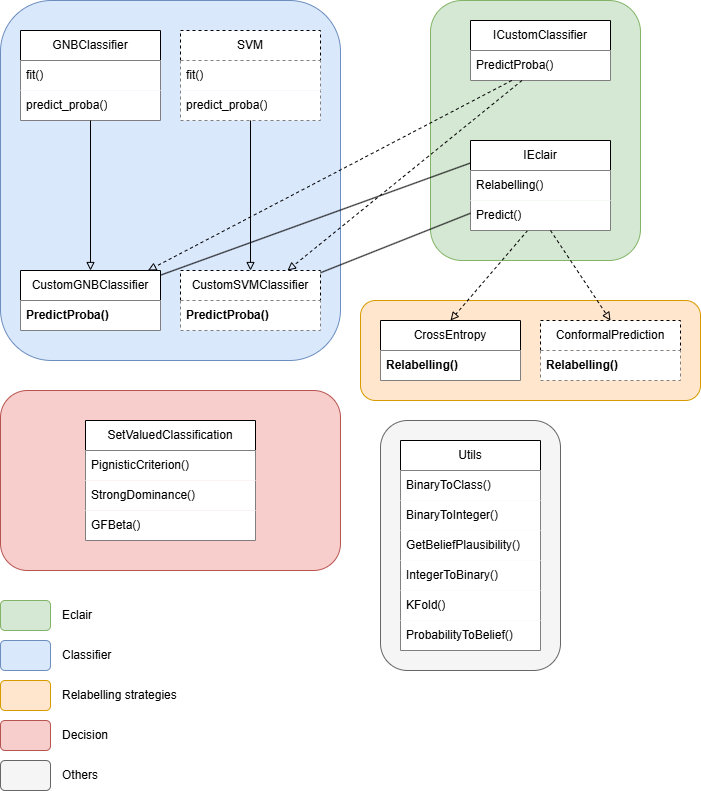

# Cautious Classification Framework

This project provides a modular and extensible framework based on the paper [Cautious Classification for Credible Learning with Uncertainty](https://imt-mines-ales.hal.science/hal-03472031v1/file/cautious-classification.pdf).

It allows researchers and developers to experiment with cautious relabelling methods for probabilistic classifiers, and to easily integrate custom strategies.

Paper authors:
* Abdelhak Imoussaten
* Lucie Jacquin

Code rewriting author:
* Pierre-Antoine Jean

## 🚀 Project Overview

The goal of this framework is to:
- Enable **cautious relabelling** of classification predictions, based on uncertainty measures,
- Allow users to plug in their **own relabelling logic** and **custom classifiers**,
- Provide a clean interface for experimentation and benchmarking.

## 🧩 Code Architecture

The project is structured around two interfaces that users must implement:

### `IEclair.py`

This interface defines the contract for any cautious relabelling method.  
It contains one abstract method:

```python
class IEclair(ABC):
    @abstractmethod
    def Relabelling(self, **kwargs) -> list[int]:
        """Compute imprecise labels based on a cautious strategy."""
        pass
````

You must implement this method in your own relabelling class.

---

### `ICustomClassification.py`

This interface defines a model capable of producing **posterior probabilities** on demand.

```python
class ICustomClassification(ABC):
    @abstractmethod
    def PredictProba(self, X_train, X_test, y_train) -> np.ndarray:
        """Return class probability predictions for X_test."""
        pass
```

You must implement this interface in your classifier class. The framework will call `PredictProba` to obtain probability distributions used by the relabelling method.



---

## 🧠 Default Method: Cross-Entropy Based Relabelling

The current implementation includes a default relabelling strategy based on **cross-entropy**, in line with the original paper.

Users can replace or extend this method by implementing their own version of `IEclair`.

```python
gnb = CustomNaiveBayesClassifier()
X, y = load_iris(return_X_y = True)

X_train, X_test, y_train, y_test = train_test_split(
    X, y, test_size = 0.2, shuffle = True, random_state = 42
)
# Get posterior probabilities on the training set for each class.
# If nb_folds = nb_samples, it's like a leave-one-out.
nb_folds = 20
posterior_probabilities = PredictProbaKFold(np.array(X_train), np.array(y_train), gnb, nb_folds)
cross_entropy = CrossEntropy(X_train, X_test, y_train, posterior_probabilities, gnb, 2, 0.6, 0.6, 2)
masses, new_y = cross_entropy.Predict()
```

`Predict` method in `IEclair` is responsible for performing the entire cautious classification pipeline, including:

* Performing cautious relabelling on the training data,
* Fitting a model on the training set with new labels,
* Predicting posterior probabilities on the test set, based on the relabelled labels.

---

## 🔧 How to Use

1. **Implement your own classifier** by subclassing `ICustomClassification`.
2. **Implement your relabelling method** by subclassing `IEclair`.
3. Use the framework to run cautious classification on your dataset.

You can combine any classifier and relabelling method that follow the two interfaces above.

## 📌 Requirements

* Python ≥ 3.10

## 🤝 Acknowledgments

Based on the publication:

> *Cautious Classification for Credible Learning with Uncertainty*,
> Hal-BLR HAL Id: [hal-03472031](https://imt-mines-ales.hal.science/hal-03472031v1)
